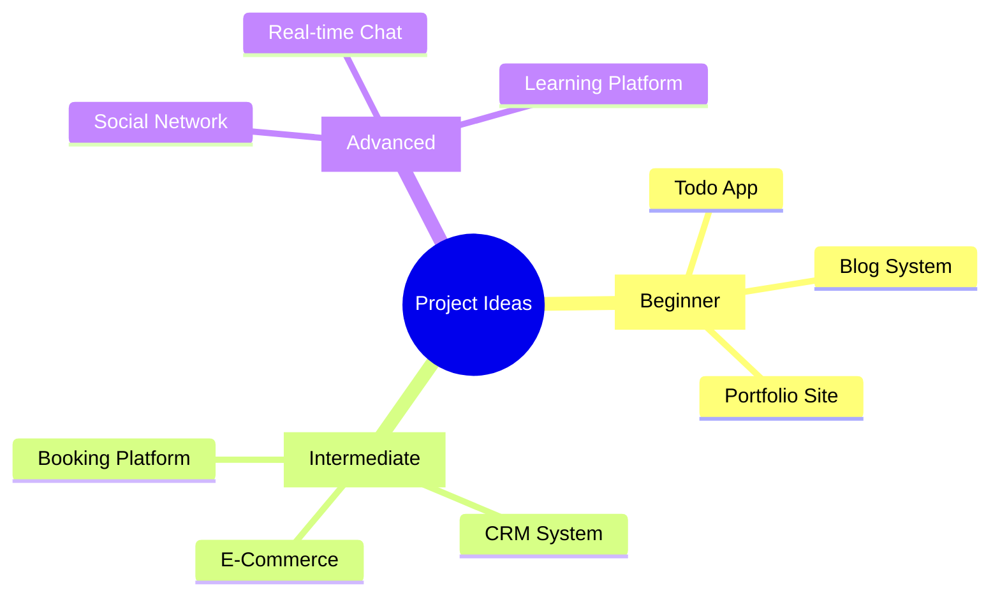

# 🚀 SMILANS APP
# Complete Web Developer Learning Path

<div align="center">


[](https://t.me/XsSmilanSsX)
[](#)
[](#)
[](#)

<p align="center">
  
</p>

</div>

## 🎯 Learning Flow

```mermaid
graph TD
    A[Start] --> B{Choose Path}
    B -->|Backend| C[Laravel]
    B -->|Frontend| D[Vue/React]
    C --> E[Database]
    D --> F[UI/UX]
    E --> G[API]
    F --> G
    G --> H[Full Stack]
```



## 💻 Learning Phases & Code Examples

<details>
<summary>📘 Phase 1: PHP Fundamentals</summary>

### 1. Basic PHP Syntax
```php
// Variables & Data Types
$name = "Smilans";
$age = 25;
$skills = ["PHP", "MySQL", "Laravel"];

// Functions
function calculateExperience($yearsOfCoding) {
    return $yearsOfCoding * 2;
}

// Arrays & Loops
foreach ($skills as $skill) {
    echo "I know $skill\n";
}

// Object Oriented Programming
class Developer {
    private $name;
    private $skills;

    public function __construct($name, $skills) {
        $this->name = $name;
        $this->skills = $skills;
    }

    public function introduce() {
        return "Hi, I'm {$this->name}";
    }
}
```

### 2. MySQL Basics
```sql
-- Create a table
CREATE TABLE users (
    id INT PRIMARY KEY AUTO_INCREMENT,
    name VARCHAR(255),
    email VARCHAR(255) UNIQUE,
    created_at TIMESTAMP
);

-- Insert data
INSERT INTO users (name, email) 
VALUES ('Smilans', 'contact@smilans.com');

-- Join example
SELECT users.name, posts.title 
FROM users 
JOIN posts ON users.id = posts.user_id;
```
</details>

<details>
<summary>📗 Phase 2: Laravel Framework</summary>

### 1. Routes & Controllers
```php
// routes/web.php
Route::get('/posts', [PostController::class, 'index']);
Route::post('/posts', [PostController::class, 'store']);

// PostController.php
class PostController extends Controller {
    public function index() {
        $posts = Post::latest()->paginate(10);
        return view('posts.index', compact('posts'));
    }

    public function store(Request $request) {
        $validated = $request->validate([
            'title' => 'required|max:255',
            'content' => 'required'
        ]);

        Post::create($validated);
        return redirect()->route('posts.index');
    }
}
```

### 2. Blade Templates
```php
<!-- layouts/app.blade.php -->
<!DOCTYPE html>
<html>
<head>
    <title>@yield('title') - Smilans App</title>
</head>
<body>
    @include('partials.nav')
    
    <div class="container">
        @yield('content')
    </div>

    @stack('scripts')
</body>
</html>

<!-- posts/show.blade.php -->
@extends('layouts.app')

@section('content')
    <div class="post">
        <h1>{{ $post->title }}</h1>
        <p>{{ $post->content }}</p>
        
        @foreach($post->comments as $comment)
            <div class="comment">
                {{ $comment->body }}
            </div>
        @endforeach
    </div>
@endsection
```

### 3. Eloquent Models & Relationships
```php
class User extends Model {
    public function posts() {
        return $this->hasMany(Post::class);
    }

    public function profile() {
        return $this->hasOne(Profile::class);
    }
}

class Post extends Model {
    protected $fillable = ['title', 'content'];

    public function user() {
        return $this->belongsTo(User::class);
    }

    public function tags() {
        return $this->belongsToMany(Tag::class);
    }
}
```
</details>

<details>
<summary>📕 Phase 3: Frontend Development</summary>

### 1. Vue.js Components
```vue
<!-- PostList.vue -->
<template>
  <div class="posts">
    <div v-for="post in posts" :key="post.id" class="post-card">
      <h2>{{ post.title }}</h2>
      <p>{{ post.excerpt }}</p>
      <button @click="readMore(post.id)">Read More</button>
    </div>
  </div>
</template>

<script>
export default {
  data() {
    return {
      posts: []
    }
  },
  async created() {
    this.posts = await this.fetchPosts()
  },
  methods: {
    async fetchPosts() {
      const response = await axios.get('/api/posts')
      return response.data
    },
    readMore(id) {
      this.$router.push(`/posts/${id}`)
    }
  }
}
</script>
```

### 2. React Components
```jsx
// PostList.jsx
import React, { useState, useEffect } from 'react';
import axios from 'axios';

const PostList = () => {
  const [posts, setPosts] = useState([]);
  const [loading, setLoading] = useState(true);

  useEffect(() => {
    fetchPosts();
  }, []);

  const fetchPosts = async () => {
    try {
      const response = await axios.get('/api/posts');
      setPosts(response.data);
    } catch (error) {
      console.error('Error fetching posts:', error);
    } finally {
      setLoading(false);
    }
  };

  if (loading) return <div>Loading...</div>;

  return (
    <div className="grid grid-cols-3 gap-4">
      {posts.map(post => (
        <div key={post.id} className="card">
          <h2>{post.title}</h2>
          <p>{post.excerpt}</p>
          <button onClick={() => navigate(`/posts/${post.id}`)}>
            Read More
          </button>
        </div>
      ))}
    </div>
  );
};
```
</details>

## 📱 Contact & Support

<div align="center">

[](https://t.me/XsSmilanSsX)


</div>

## 🌟 Project Ideas



## 💪 Daily Practice

<div align="center">

| Time | Activity |
|------|----------|
| 🌅 Morning | Code Review & Planning |
| 💻 Afternoon | Active Coding & Learning |
| 🌙 Evening | Project Work & Practice |

</div>

## 📊 Learning Progress


---

<div align="center">

### 🏆 Created with ❤️ by SMILANS APP


[](#)

</div>
